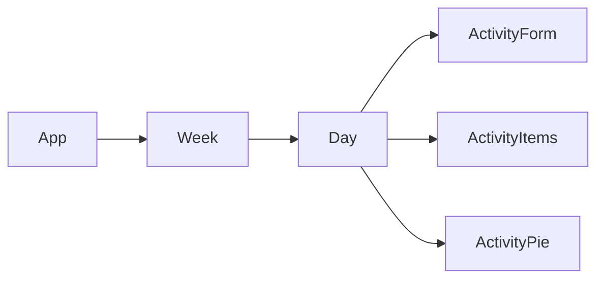

# TimeTrackr

## Component Architecture

## Database Structure

### SQLite

Activity(name VARCHAR(100), start TEXT, end TEXT)

*start* and *end* are ISO 8601 timestamps

## Technologies Used

- Day.js
- Firebase (If using GCP)
- React
- Recharts
- Sequelize (If using SQLite)
- SQLite3 (If using SQLite)

## Todo

- [x] Users can see their activity for a day as a list
- [ ] Users cam enter their activity
    - [x] There is a form for users to enter activity
    - [ ] After entering, the new entry is displayed immediately
- [ ] Users can view their activity data for a *blank* as a pie chart
    - [x] Day
    - [ ] Week
- [ ] Users can edit entered activity
- [ ] Users have individual accounts whose data is isolated from others
